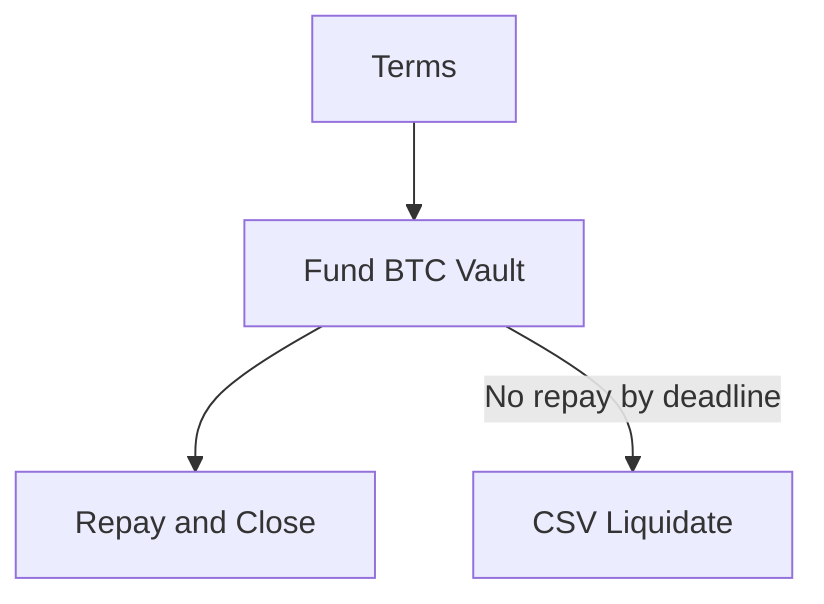

SSV — Taproot Vault Toolkit (Lean)

- Two-path policy in one tapscript:
  - CLOSE: sha256(s)=h + borrower signature
  - LIQUIDATE: CSV timelock + provider signature

Flow

Note: USDT (RGB) moves at DISBURSE (provider→borrower) and at REPAY (borrower→provider). REPAY is co‑anchored to the Close tx that reveals `s` (sha256(s)=`h`) for atomic settlement.

Primitive (Taproot policy)
```
OP_IF
  OP_SHA256 `h` OP_EQUALVERIFY
  `pk_b` OP_CHECKSIG
OP_ELSE
  `csv_blocks` OP_CHECKSEQUENCEVERIFY OP_DROP
  `pk_p` OP_CHECKSIG
OP_ENDIF
```

Witness stacks (script‑path)
- Borrower (CLOSE): `[sig_b, s, 0x01, tapscript, control]`
- Provider (LIQUIDATE): `[sig_p, 0x00, tapscript, control]`

Parameters to agree
- `h = sha256(s)` (32B preimage `s`)
- `csv_blocks` (relative blocks for LIQUIDATE)
- `pk_b`, `pk_p` (x‑only Taproot keys)
- `principal_usdt`, `interest_usdt`
- Optional: `maturity_height` (RGB‑side guard only)

End‑to‑end summary
1) Borrower funds BTC Taproot vault (policy above).
2) Provider DISBURSE: transfers `principal_usdt` on RGB to the borrower.
3) Repay and Close (preferred): single anchor tx that spends the vault via CLOSE (reveals `s`) and anchors RGB REPAY (verifies `sha256(s)=h` and pays provider ≥ principal+interest); BTC returns to borrower.
4) If no repay by deadline: provider LIQUIDATE after `csv_blocks` via the CSV branch to claim BTC.

CLI quick start (docker)
- Build tapscript (human output or JSON with --json):
  `docker compose exec ssv ssv build-tapscript --hash-h \`h\` --borrower-pk \`xonly_b\` --csv-blocks \`csv_blocks\` --provider-pk \`xonly_p\` --disasm [--json]`
- Finalize PSBT (borrower):
  `docker compose exec ssv ssv finalize --mode borrower --psbt-in close.psbt --psbt-out close.final.psbt --tx-out close.final.tx --sig \`SIG_B\` --preimage \`s\` --hash-h \`h\` --borrower-pk \`xonly_b\` --csv-blocks \`csv_blocks\` --provider-pk \`xonly_p\` --control \`CTRL\` [--require-anchor-index i --require-anchor-spk SPK --require-anchor-value SAT]`
- Finalize PSBT (provider):
  `docker compose exec ssv ssv finalize --mode provider --psbt-in liq.psbt --psbt-out liq.final.psbt --tx-out liq.final.tx --sig \`SIG_P\` --hash-h \`h\` --borrower-pk \`xonly_b\` --csv-blocks \`csv_blocks\` --provider-pk \`xonly_p\` --control \`CTRL\``

Implementation notes (concise)
- RGB coupling: DISBURSE (provider→borrower), REPAY (borrower→provider). Co‑anchor REPAY with CLOSE and check `sha256(s)=h`. CSV liquidation is L1 only.
- PSBT plans:
  - CLOSE+REPAY: inputs = vault UTXO (+ fees); outputs = borrower BTC (+ change); attach RGB REPAY anchor; finalize `[sig_b, s, 0x01, tapscript, control]`.
  - LIQUIDATE: input = vault UTXO with `nSequence=csv_blocks`; output = provider BTC; finalize `[sig_p, 0x00, tapscript, control]`.
  - CSV steps: wait ≥ `csv_blocks` confs; PSBT `nSequence=csv_blocks` (v≥2); finalize provider witness; broadcast.

Control block (where to get it)
- Use descriptor wallets (Taproot tr()), then build PSBTs with your wallet. When you select the script‑path spend, most wallets include the Taproot leaf script and control block in PSBT fields. Export the control block hex and pass it to the CLI finalize step.
- If your stack doesn’t expose control blocks directly, consult the wallet’s PSBT export or signing API. The control block must match the tapscript leaf and internal key used in the descriptor.

CSV encoding (quick ref)
- nSequence is a 32‑bit field; for block‑based CSV:
  - Disable flag (bit 31) = 0
  - Type flag (bit 22) = 0 (blocks, not time)
  - Value = `csv_blocks` in low 16 bits
- Example: `csv_blocks = 144` → nSequence = `0x00000090`; tx version must be ≥ 2.

Path verification (optional)
- Verify tapscript/control against the witness UTXO scriptPubKey (human output or JSON with --json):
  - With PSBT: `docker compose exec ssv ssv verify-path --tapscript-file tapscript.hex --control-file control.hex --psbt-in input.psbt [--json]`
  - Or direct SPK: `docker compose exec ssv ssv verify-path --tapscript <HEX> --control <HEX> --witness-spk <HEX> [--json]`
- Output shows ok / expected_spk / actual_spk and a reason on mismatch.

Demos (docker, regtest)
- CLOSE+REPAY skeleton (prompts to attach RGB anchor): `make demo-close`
- CSV LIQUIDATE skeleton: `make demo-liq`
- Use `make docker-up` first to start containers; `make docker-logs` to tail Core logs.

TapRet (lean anchoring)
- SSV stays Taproot-vault–focused. RGB tooling must supply the TapRet anchor scriptPubKey (hex) and value (sats).
- Recommended minimal flow for CLOSE+REPAY:
  1) Use your RGB tool to compute the TapRet anchor SPK and choose a dust-safe value.
  2) Insert that anchor output into the CLOSE PSBT using your wallet or helper scripts.
  3) Verify before finalizing: `ssv anchor-verify --psbt-in close.psbt --index <i> --spk <SPK_HEX> --value <SAT> [--json]`.
  4) Finalize borrower witness with `ssv finalize`.
- Notes:
  - Use a dedicated anchor output at a known index to avoid wallet coordination.
  - Keep the anchor output (index, spk, value) identical across RBF bumps.
  - Dust: ensure the anchor output value is above network dust thresholds.
  - Optional guard: add `--require-anchor-*` (or `--require-opret-*`) to `ssv finalize` to enforce the anchor is present before witness finalize.

OP_RETURN fallback (optional)
- If TapRet is impractical for your setup, you can anchor with OP_RETURN data instead:
  - Insert an OP_RETURN output into the CLOSE PSBT with your commitment bytes: script = OP_RETURN <data>.
  - Verify: `ssv opret-verify --psbt-in close.psbt --index <i> --data <HEX> [--value 0] [--json]`.
  - Then finalize as usual.

Verify-path dependency
- The `ssv` container includes coincurve; `verify-path` works out of the box.

Appendix

Descriptor example (Taproot)
```
tr(
  `internal_pub`,
  {
    and_v( v:sha256(`h`), pk(`pk_b`) ),
    and_v( v:older(`csv_blocks`), pk(`pk_p`) )
  }
)
```
Use Core’s `getdescriptorinfo` to checksum/canonicalize, then `importdescriptors` into the vault wallet.

Key derivation tips (Core via docker)
- Internal key (`internal_pub`) for tr():
  - `VAULT_ADDR=$(docker compose exec -T bitcoin bitcoin-cli -regtest -rpcwallet=vault getnewaddress "" bech32m)`
  - `INTERNAL_PUB=$(docker compose exec -T bitcoin bitcoin-cli -regtest -rpcwallet=vault getaddressinfo "$VAULT_ADDR" | jq -r .pubkey)`  # 33‑byte compressed
- X‑only keys for tapscript pk():
  - Borrower: `BORR_ADDR=$(docker compose exec -T bitcoin bitcoin-cli -regtest -rpcwallet=borrower getnewaddress "" bech32m)`
  - `BORR_COMP=$(docker compose exec -T bitcoin bitcoin-cli -regtest -rpcwallet=borrower getaddressinfo "$BORR_ADDR" | jq -r .pubkey)`
  - `pk_b=${BORR_COMP:2}`  # drop leading 02/03 to get 32‑byte x‑only
  - Provider: `PROV_ADDR=$(docker compose exec -T bitcoin bitcoin-cli -regtest -rpcwallet=provider getnewaddress "" bech32m)`
  - `PROV_COMP=$(docker compose exec -T bitcoin bitcoin-cli -regtest -rpcwallet=provider getaddressinfo "$PROV_ADDR" | jq -r .pubkey)`
  - `pk_p=${PROV_COMP:2}`
Notes: tr() uses the 33‑byte internal compressed pubkey; tapscript pk() uses 32‑byte x‑only keys.

No jq? Alternatives (via docker)
- Python one‑liner (recommended):
  - Internal: `INTERNAL_PUB=$(docker compose exec -T bitcoin bitcoin-cli -regtest -rpcwallet=vault getaddressinfo "$VAULT_ADDR" | python3 -c 'import sys,json; print(json.load(sys.stdin)["pubkey"])')`
  - Borrower: `BORR_COMP=$(docker compose exec -T bitcoin bitcoin-cli -regtest -rpcwallet=borrower getaddressinfo "$BORR_ADDR" | python3 -c 'import sys,json; print(json.load(sys.stdin)["pubkey"])')`
  - Provider: `PROV_COMP=$(docker compose exec -T bitcoin bitcoin-cli -regtest -rpcwallet=provider getaddressinfo "$PROV_ADDR" | python3 -c 'import sys,json; print(json.load(sys.stdin)["pubkey"])')`

Helper script
- Derive keys conveniently from loaded wallets via the container:
  - `docker compose exec -T ssv python tools/derive_keys.py --all`  # vault/borrower/provider (new bech32m addresses)
  - `docker compose exec -T ssv python tools/derive_keys.py --wallet vault --new`
  - `docker compose exec -T ssv python tools/derive_keys.py --wallet borrower --address <BECH32M>`

Compute preimage and hash (s and h)
- Random 32‑byte preimage `s` and its SHA‑256 `h` (bash + OpenSSL):
  - `s=$(openssl rand -hex 32)`
  - `h=$(printf "%s" "$s" | xxd -r -p | openssl dgst -sha256 -binary | xxd -p -c 256)`
- Python alternative:
  - `python - <<'PY'\nimport os,hashlib; s=os.urandom(32).hex(); h=hashlib.sha256(bytes.fromhex(s)).hexdigest(); print('s=',s); print('h=',h)\nPY`
- Use `h` when building the tapscript and keep `s` for CLOSE (borrower path).


Docker usage (step‑by‑step)

Use Docker for a reproducible setup with bitcoind (regtest), SSV, and rgb.

1) Build and start containers
- `make docker-up`
- `make docker-logs` to tail Core logs (Ctrl+C to stop tailing)

2) Run the CLOSE+REPAY demo skeleton
- `make demo-close`
- The script will:
  - Create vault/borrower/provider wallets in bitcoind
  - Derive keys via the ssv container
  - Build tapscript, import descriptor, and fund the vault
  - Pause to let you anchor RGB REPAY using `docker compose exec ssv rgb ...`
  - Finalize borrower witness with `ssv finalize`

3) CSV LIQUIDATION demo
- `make demo-liq` to run the provider path after CSV blocks elapse

Troubleshooting
- Ensure PSBTs include `witness_utxo` (use walletprocesspsbt if necessary).
- CSV spends require tx version ≥ 2 and input nSequence=CSV.
- Control block and signatures come from your signing wallet when preparing the Taproot script‑path spend.


Developer notes (modules and helpers)
- ssv.tapscript: tapscript builder for the two-branch policy; tapleaf hashing; disasm.
- ssv.policy: PolicyParams dataclass + validate() for input invariants.
- ssv.taproot: Taproot helpers (parse control block, compute output key, scriptPubKey build).
 - ssv.psbtio: PSBT load/write utilities (hex/base64 auto-detect), raw tx conversion, witness_utxo SPK extraction.
 - ssv.witness: witness stack builder with Branch enum (CLOSE / LIQUIDATE) and IF/ELSE selectors.
 - ssv.cli anchor-verify: lean check that a PSBT contains the expected TapRet anchor output at the given index.
  - ssv.cli opret-verify: lean check for an OP_RETURN output with expected data.
  - ssv.cli anchor-show: convenience listing of PSBT outputs.


Dockerized setup (reproducible)

If you prefer to run everything in containers (bitcoind + SSV + rgb CLI), use the provided Dockerfile and docker-compose.yml.

Quick start
- Build and start: `make docker-up`
- Tail bitcoind logs: `make docker-logs`
- Run CLOSE+REPAY demo (dockerized helpers):
  - `bash examples/close_repay_demo_docker.sh`
  - The script uses:
    - `docker compose exec bitcoin bitcoin-cli ...` for Core RPC calls, and
    - `docker compose exec ssv ssv ...` / `docker compose exec ssv python ...` for SSV and helpers.
- Run CSV LIQUIDATE demo (dockerized):
  - `bash examples/liq_demo_docker.sh`
- Stop containers: `make docker-down`

Notes
- The `ssv` container image includes Python deps and the `rgb` CLI (compiled via Cargo) so you can attach RGB anchors inside the same container.
- The `bitcoin` service uses regtest with txindex and default RPC auth (see docker-compose.yml). Adjust RPC options as needed.
- Example scripts still require manual signatures and a control block obtained from your signing wallet.


Development and tests
- Create a virtualenv and install dev extras:
  - `python3 -m venv .venv && source .venv/bin/activate`
  - `pip install -r requirements-dev.txt`  # installs editable package with dev deps
  - Alternatively: `pip install -e '.[dev]'`
  - Note: python-bitcointx is pinned (>=1.1.0) to ensure PSBT API availability for tests.
- Run tests: `make test` (or `pytest -q`)
- Editor (VS Code/Pylance): select the same virtualenv interpreter so pytest/coincurve are resolved and import warnings disappear.
- Some tests are skipped if optional deps are not installed (coincurve, python-bitcointx).
