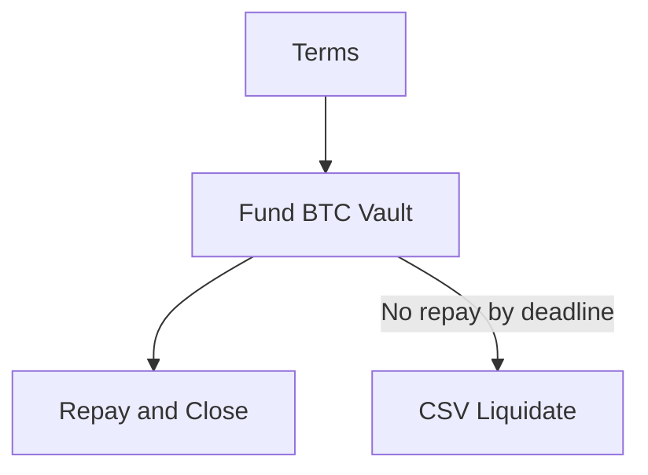

SSV — Taproot Vault Toolkit (Lean)

- Two-path policy in one tapscript:
  - CLOSE: sha256(s)=h + borrower signature
  - LIQUIDATE: CSV timelock + provider signature

Flow

Note: USDT (RGB) moves at DISBURSE (provider→borrower) and at REPAY (borrower→provider). REPAY is co‑anchored to the Close tx that reveals `s` (sha256(s)=`h`) for atomic settlement.

Primitive (Taproot policy)
```
OP_IF
  OP_SHA256 `h` OP_EQUALVERIFY
  `pk_b` OP_CHECKSIG
OP_ELSE
  `csv_blocks` OP_CHECKSEQUENCEVERIFY OP_DROP
  `pk_p` OP_CHECKSIG
OP_ENDIF
```

Witness stacks (script‑path)
- Borrower (CLOSE): `[sig_b, s, 0x01, tapscript, control]`
- Provider (LIQUIDATE): `[sig_p, 0x00, tapscript, control]`

Parameters to agree
- `h = sha256(s)` (32B preimage `s`)
- `csv_blocks` (relative blocks for LIQUIDATE)
- `pk_b`, `pk_p` (x‑only Taproot keys)
- `principal_usdt`, `interest_usdt`
- Optional: `maturity_height` (RGB‑side guard only)

End‑to‑end summary
1) Borrower funds BTC Taproot vault (policy above).
2) Provider DISBURSE: transfers `principal_usdt` on RGB to the borrower.
3) Repay and Close (preferred): single anchor tx that spends the vault via CLOSE (reveals `s`) and anchors RGB REPAY (verifies `sha256(s)=h` and pays provider ≥ principal+interest); BTC returns to borrower.
4) If no repay by deadline: provider LIQUIDATE after `csv_blocks` via the CSV branch to claim BTC.

CLI quick start
- Build tapscript:
  `python -m ssv.cli build-tapscript --hash-h \`h\` --borrower-pk \`xonly_b\` --csv-blocks \`csv_blocks\` --provider-pk \`xonly_p\` --disasm`
- Finalize PSBT (borrower):
  `python -m ssv.cli finalize --mode borrower --psbt-in close.psbt --psbt-out close.final.psbt --tx-out close.final.tx --sig \`SIG_B\` --preimage \`s\` --hash-h \`h\` --borrower-pk \`xonly_b\` --csv-blocks \`csv_blocks\` --provider-pk \`xonly_p\` --control \`CTRL\``
- Finalize PSBT (provider):
  `python -m ssv.cli finalize --mode provider --psbt-in liq.psbt --psbt-out liq.final.psbt --tx-out liq.final.tx --sig \`SIG_P\` --hash-h \`h\` --borrower-pk \`xonly_b\` --csv-blocks \`csv_blocks\` --provider-pk \`xonly_p\` --control \`CTRL\``

Implementation notes (concise)
- RGB coupling: DISBURSE (provider→borrower), REPAY (borrower→provider). Co‑anchor REPAY with CLOSE and check `sha256(s)=h`. CSV liquidation is L1 only.
- PSBT plans:
  - CLOSE+REPAY: inputs = vault UTXO (+ fees); outputs = borrower BTC (+ change); attach RGB REPAY anchor; finalize `[sig_b, s, 0x01, tapscript, control]`.
  - LIQUIDATE: input = vault UTXO with `nSequence=csv_blocks`; output = provider BTC; finalize `[sig_p, 0x00, tapscript, control]`.
  - CSV steps: wait ≥ `csv_blocks` confs; PSBT `nSequence=csv_blocks` (v≥2); finalize provider witness; broadcast.

Control block (where to get it)
- Use descriptor wallets (Taproot tr()), then build PSBTs with your wallet. When you select the script‑path spend, most wallets include the Taproot leaf script and control block in PSBT fields. Export the control block hex and pass it to the CLI finalize step.
- If your stack doesn’t expose control blocks directly, consult the wallet’s PSBT export or signing API. The control block must match the tapscript leaf and internal key used in the descriptor.

CSV encoding (quick ref)
- nSequence is a 32‑bit field; for block‑based CSV:
  - Disable flag (bit 31) = 0
  - Type flag (bit 22) = 0 (blocks, not time)
  - Value = `csv_blocks` in low 16 bits
- Example: `csv_blocks = 144` → nSequence = `0x00000090`; tx version must be ≥ 2.

Path verification (optional)
- Verify tapscript/control against the witness UTXO scriptPubKey (requires coincurve):
  - With PSBT: `python -m ssv.cli verify-path --tapscript-file tapscript.hex --control-file control.hex --psbt-in input.psbt`
  - Or direct SPK: `python -m ssv.cli verify-path --tapscript <HEX> --control <HEX> --witness-spk <HEX>`
- Output shows ok / expected_spk / actual_spk and a reason on mismatch.

Demos (regtest)
- CLOSE+REPAY skeleton (prompts to attach RGB anchor): `make demo-close`
- CSV LIQUIDATE skeleton: `make demo-liq`
- Prereqs: bitcoind -regtest running; wallets vault/borrower/provider loaded; `jq` installed.

Verify-path dependency
- The `verify-path` subcommand requires `coincurve`:
  - `pip install coincurve`
- Without it, the command returns `ok=null` and prints a helpful message.

Appendix

Descriptor example (Taproot)
```
tr(
  `internal_pub`,
  {
    and_v( v:sha256(`h`), pk(`pk_b`) ),
    and_v( v:older(`csv_blocks`), pk(`pk_p`) )
  }
)
```
Use Core’s `getdescriptorinfo` to checksum/canonicalize, then `importdescriptors` into the vault wallet.

Key derivation tips (Core)
- Internal key (`internal_pub`) for tr():
  - `VAULT_ADDR=$(bitcoin-cli -regtest -rpcwallet=vault getnewaddress "" bech32m)`
  - `INTERNAL_PUB=$(bitcoin-cli -regtest -rpcwallet=vault getaddressinfo "$VAULT_ADDR" | jq -r .pubkey)`  # 33‑byte compressed
- X‑only keys for tapscript pk():
  - Borrower: `BORR_ADDR=$(bitcoin-cli -regtest -rpcwallet=borrower getnewaddress "" bech32m)`
  - `BORR_COMP=$(bitcoin-cli -regtest -rpcwallet=borrower getaddressinfo "$BORR_ADDR" | jq -r .pubkey)`
  - `pk_b=${BORR_COMP:2}`  # drop leading 02/03 to get 32‑byte x‑only
  - Provider: `PROV_ADDR=$(bitcoin-cli -regtest -rpcwallet=provider getnewaddress "" bech32m)`
  - `PROV_COMP=$(bitcoin-cli -regtest -rpcwallet=provider getaddressinfo "$PROV_ADDR" | jq -r .pubkey)`
  - `pk_p=${PROV_COMP:2}`
Notes: tr() uses the 33‑byte internal compressed pubkey; tapscript pk() uses 32‑byte x‑only keys.

No jq? Alternatives
- Python one‑liner (recommended):
  - Internal: `INTERNAL_PUB=$(bitcoin-cli -regtest -rpcwallet=vault getaddressinfo "$VAULT_ADDR" | python3 -c 'import sys,json; print(json.load(sys.stdin)["pubkey"])')`
  - Borrower: `BORR_COMP=$(bitcoin-cli -regtest -rpcwallet=borrower getaddressinfo "$BORR_ADDR" | python3 -c 'import sys,json; print(json.load(sys.stdin)["pubkey"])')`
  - Provider: `PROV_COMP=$(bitcoin-cli -regtest -rpcwallet=provider getaddressinfo "$PROV_ADDR" | python3 -c 'import sys,json; print(json.load(sys.stdin)["pubkey"])')`
- Pure shell (quick & brittle JSON grep):
  - `INTERNAL_PUB=$(bitcoin-cli -regtest -rpcwallet=vault getaddressinfo "$VAULT_ADDR" | grep -o '"pubkey": *"[^"]*"' | cut -d'"' -f4)`

Helper script
- Derive keys conveniently from loaded wallets:
  - `python tools/derive_keys.py --all`  # vault/borrower/provider (new bech32m addresses)
  - `python tools/derive_keys.py --wallet vault --new`
  - `python tools/derive_keys.py --wallet borrower --address <BECH32M>`

Compute preimage and hash (s and h)
- Random 32‑byte preimage `s` and its SHA‑256 `h` (bash + OpenSSL):
  - `s=$(openssl rand -hex 32)`
  - `h=$(printf "%s" "$s" | xxd -r -p | openssl dgst -sha256 -binary | xxd -p -c 256)`
- Python alternative:
  - `python - <<'PY'\nimport os,hashlib; s=os.urandom(32).hex(); h=hashlib.sha256(bytes.fromhex(s)).hexdigest(); print('s=',s); print('h=',h)\nPY`
- Use `h` when building the tapscript and keep `s` for CLOSE (borrower path).

